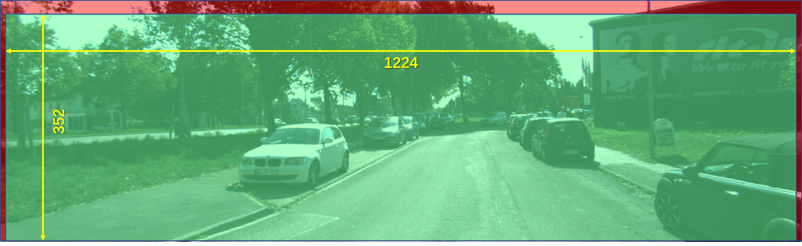

# 准备数据集，用于3D点回归
基于kitti数据集转换
## kitti_2_3Dpoints.py
处理kitti的图片与标签，所有图片统一尺寸至(352, 1216, 3), 并且生成如下格式的标签




```bash
IMAGE_DIR="../kitti/training/image_2/"
BOX2D_PATH="../kitti/training/label_2/"
CALIB_DIR="../kitti/training/calib/"
OUT_PATH="../newlabel1/"
CLASSES=['Car', 'Van', 'Truck']
DEBUG=False

python kitti_2_3Dpoints.py \
	--image_dir=${IMAGE_DIR} \
	--box2d_path=${BOX2D_PATH} \
	--calib_dir=${CALIB_DIR} \
	--out_path=${OUT_PATH} \
	--classes=${CLASSES} \
	--debug=${DEBUG}
```

